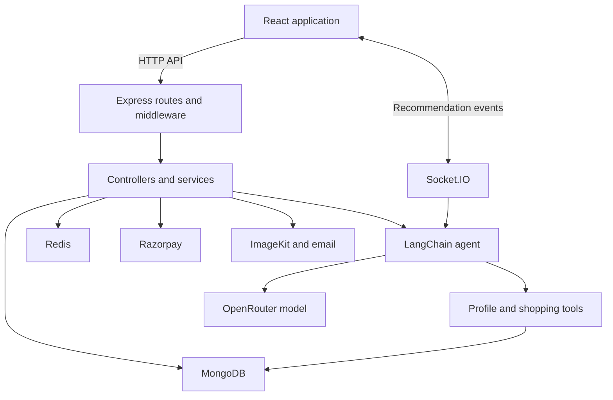
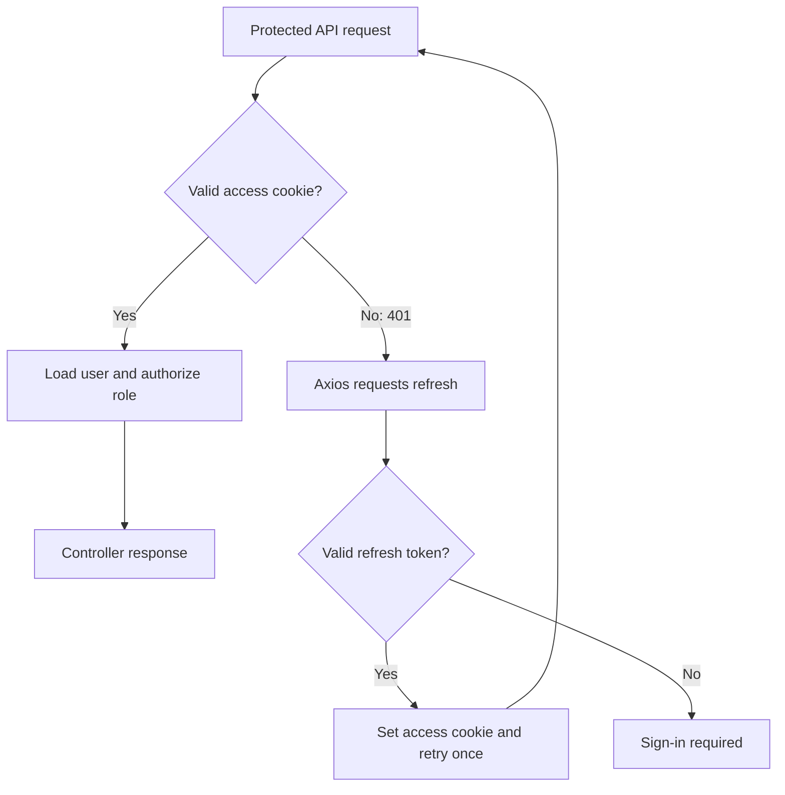
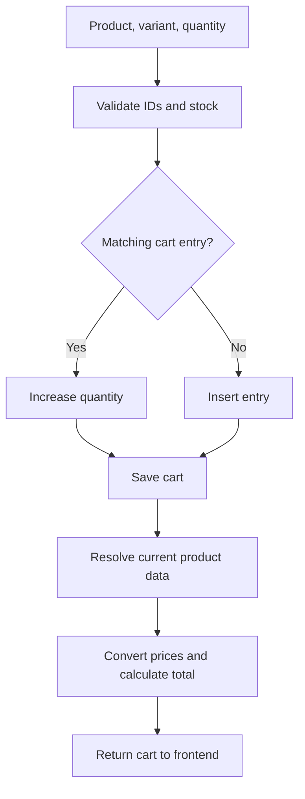
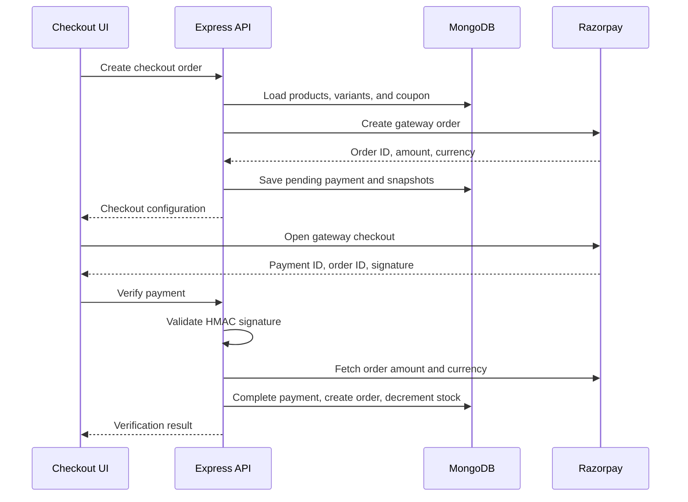
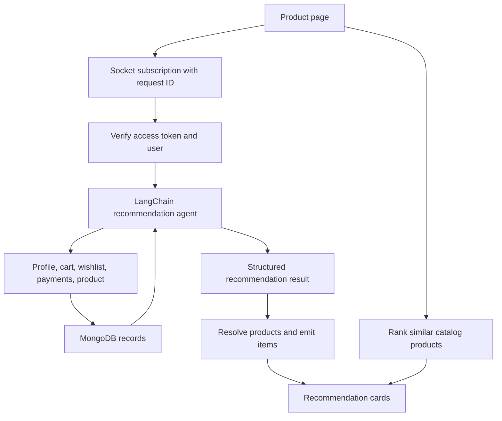
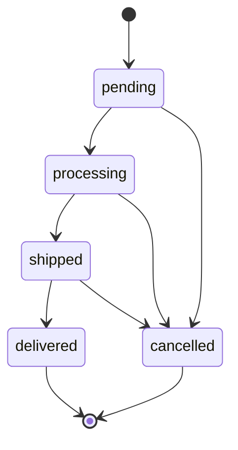

# Snitch

### A full-stack fashion marketplace with seller operations and AI recommendations

Snitch brings product discovery, variant-based shopping, wishlists, cart management, Razorpay checkout, and seller workflows into one application. Buyers can browse and purchase products, while sellers manage listings, inventory, orders, reviews, returns, and promotional coupons.

The frontend uses React and Redux Toolkit. The backend uses Express, MongoDB, and Redis, with Socket.IO for recommendation delivery and LangChain with OpenRouter for AI features.

[Repository](https://github.com/soumojitbagchi/Snitch) · [Author](https://github.com/soumojitbagchi)

> This README describes the source at commit `4e16919e61efa8e9ce16cc0600ce65310bcb1029`. It documents implemented code paths; it does not certify live services or production readiness.

## Contents

- [Features](#features)
- [Technology stack](#technology-stack)
- [Architecture](#architecture)
- [How it works](#how-it-works)
- [Data model](#data-model)
- [Project structure](#project-structure)
- [Local setup](#local-setup)
- [Environment configuration](#environment-configuration)
- [API reference](#api-reference)
- [Socket events](#socket-events)
- [Scripts and verification](#scripts-and-verification)
- [Deployment](#deployment)
- [Current limitations](#current-limitations)
- [Troubleshooting](#troubleshooting)
- [Contributing](#contributing)
- [License](#license)

## Features

### Buyer experience

- Email/password authentication and Google OAuth.
- Product catalog, search, category filters, and product details.
- Product variants with size, color, price, stock, and images.
- Persistent cart with quantity controls and stock checks.
- Wishlist management and direct Buy Now checkout.
- Display-currency selection for INR, USD, EUR, and GBP.
- Coupon validation and Razorpay payment verification.
- Order history, fulfillment status, product reviews, and return requests.
- Profile editing, saved addresses, and light/dark/system theme preferences.
- AI recommendations with a similarity-based fallback.

### Seller workspace

- Create and edit products, images, variants, pricing, and sale visibility.
- AI-generated product descriptions during listing creation.
- Individual and bulk product deletion.
- Low-stock monitoring, restocking, stock-alert emails, and sales velocity.
- Order management with fulfillment transitions and status history.
- Dashboard statistics and an attention feed.
- Review replies, return decisions, and seller coupons.
- Earnings and settlement summaries calculated from payment records.

## Technology stack

| Layer | Technologies | Purpose |
| --- | --- | --- |
| Frontend | React 19, Vite 8, React Router 7 | Interface, development server, routing |
| State and requests | Redux Toolkit, React Redux, Axios | Shared state and credentialed API calls |
| Styling | Tailwind CSS 4, Motion | Styling and animation |
| Backend | Node.js 22, Express 5 | HTTP API and application services |
| Persistence | MongoDB, Mongoose | Users, products, carts, payments, and operational records |
| Cache | Redis, browser sessionStorage | Short-lived catalog and conversion caches |
| Authentication | JWT, bcrypt, Passport Google OAuth | Password hashing, cookies, Google sign-in |
| AI | LangChain, OpenRouter, Zod | Tool-driven recommendations and descriptions |
| Realtime | Socket.IO | Recommendation request lifecycle and item delivery |
| Payments | Razorpay | Gateway order creation and signature verification |
| Media and email | ImageKit, Multer, Nodemailer | Image uploads and transactional emails |
| Middleware | Helmet, CORS, express-validator, Morgan | Headers, origins, validation, request logging |

Both packages declare Node.js `22.x`. Mistral packages and configuration remain in the repository, but the inspected AI service uses OpenRouter.

## Architecture



React feature hooks coordinate API calls and Redux updates. Express routes apply authentication and upload middleware before calling controllers. Services handle checkout calculations, currency conversion, cache access, email, uploads, and AI calls. MongoDB stores durable records; Redis stores expiring copies of selected data.

## How it works

### 1. Authentication and session renewal

Email/password sign-in verifies the stored bcrypt hash. Google sign-in uses Passport and a backend callback. Successful authentication sets HTTP-only `accessToken` and `refreshToken` cookies.

- Access tokens expire after **one hour**, signed with `JWT_KEY`.
- Refresh tokens expire after **seven days**, signed with `JWT_SESSION_KEY`.
- Protected API routes read the access cookie and load the user from MongoDB.
- General authentication accepts logged-in users; seller middleware additionally rejects buyers.
- Axios sends credentials. On a protected request's first `401`, it requests `/api/auth/refresh` and retries once. Concurrent refresh requests share one promise.
- Production cookies use `Secure` and `SameSite=None`; local cookies use `SameSite=Lax`.



### 2. Product listings and images

Seller product creation accepts multipart fields including `title`, `description`, `priceAmount`, `priceCurrency`, `size`, `color`, `stockAmount`, `category`, and `tags`. Images use the `images` field.

1. Seller middleware authenticates the request.
2. Multer reads up to **five images**, each limited to **5 MB**. Accepted MIME types are JPEG, PNG, GIF, and WebP.
3. OpenRouter generates a concise description from the supplied product facts.
4. ImageKit receives the uploaded image buffers.
5. MongoDB stores the listing and its initial variant.
6. The catalog cache is invalidated.

Description generation runs before uploads and persistence. A description-service failure returns `503` and prevents creation.

### 3. Variant-aware cart

Cart entries reference a product and its selected variant. Adding an item checks IDs, positive whole-number quantity, variant membership, and available stock. Matching product/variant entries have their quantity increased; other selections create separate entries.

The response builder populates product references, resolves each variant, converts its current price to the cart's display currency, and recalculates the total. Cart prices are rebuilt from product data rather than treated as fixed purchase prices.



### 4. Checkout and payment

The API supports `source: "cart"` and `source: "direct"`. Cart checkout reads the authenticated user's stored cart. Direct checkout accepts product IDs, variant IDs, and quantities.

The server independently loads prices and stock, validates the items and coupon, calculates the payable amount, and snapshots product title, image, size, color, and price. It creates a Razorpay order and a pending `Payment` record. Browser-supplied titles and prices are not authoritative.



Verification uses HMAC-SHA256 and a timing-safe signature comparison, locates the user's pending payment, and checks gateway amount/currency. The current write sequence marks the payment completed, creates fulfillment, then decrements stock. Coupon redemption and confirmation email follow. These writes are not one transaction; see [current limitations](#current-limitations).

A completed payment returns an “already verified” response on a subsequent verification request. An hourly in-process sweep marks pending payments older than 24 hours as failed.

### 5. Currency conversion

The conversion API supports INR, USD, EUR, and GBP. `RATE_EXCHANGE` must identify a provider endpoint compatible with this request and response contract:

```text
GET <RATE_EXCHANGE>/<FROM>/<TO>
```

```json
{ "rate": 0.012 }
```

Same-currency conversion returns a rate of `1`. The conversion endpoint caches rates for **12 hours** in Redis. Cart and checkout services call the exchange helper directly, so their conversion calls do not share this endpoint's rate cache.

Cart checkout uses the persisted cart display currency. Direct checkout derives currency from the selected variant and requires matching native currencies across items. A frontend conversion quote does not currently change the direct checkout gateway currency.

### 6. AI recommendations

The recommendation service creates a LangChain agent backed by the configured OpenRouter model. Its tools expose user profile, cart, wishlist, recent payment history, and individual products. Zod defines a structured response with one to eight recommendations, including product ID, reason, and recommendation type.



The frontend loads similarity-ranked alternatives in parallel. The first AI item replaces the fallback list. If no AI items arrive, similarity results or bundled fallback products remain. A six-second timer stops the loading indicator; it does not terminate the model call.

Socket items are emitted **after the agent returns its result**, so this is incremental product delivery rather than model-token streaming. Request IDs prevent unrelated responses from updating the current section. Unsubscription stops subsequent item delivery, but does not abort the agent invocation.

The toolset does not currently include broad inventory search or browsing/search-event history, even though the agent prompt discusses those possibilities. Recommendations depend on the records available through its actual tools. Profile data and shopping records can be sent to the configured model provider.

### 7. Fulfillment and returns

Fulfillment is stored separately from payment. Seller order transitions are checked against an allowed transition map, and every successful change appends a timestamped history entry.



Returns move from `requested` to `approved` or `rejected`; approved requests can move to `refunded`. Marking a return refunded restores product stock and updates the record. It does not call the Razorpay refunds API.

## Data model

| Record | Main responsibility | Relationships |
| --- | --- | --- |
| User | Identity, role, provider, profile, addresses, preferences | Referenced by carts, wishlists, payments, and products |
| Product | Listing, seller, category, tags, sale flag | Embeds variants with price, stock, attributes, and images |
| Cart | User's selected products and display currency | References products and variant IDs |
| Wishlist | Saved products | References user and products |
| Payment | Gateway IDs, amount, state, sellers, coupon, item snapshots | References user and purchased products |
| Order | Fulfillment state, history, SLA due date | Unique payment reference |
| Coupon | Discount type/value, limits, expiry, redemption stock | Optional seller scope |
| Review | Rating, review content, seller response | Product and user references |
| ReturnRequest | Requested items, reason, decision state | Buyer, seller, payment, product, and variant references |

`Payment` answers “what was paid for?”; `Order` answers “where is fulfillment?”. Variant price/stock belongs to the embedded variant, not to one universal product price.

## Project structure

| Path | Responsibility |
| --- | --- |
| `backend/src/server.js` | Connect persistence, start HTTP/socket server, schedule stale-payment sweep |
| `backend/src/app/app.js` | Express middleware, Passport, route mounts, error handler |
| `backend/src/config/` | Environment validation, MongoDB, Redis |
| `backend/src/routes/` | API endpoints and route middleware |
| `backend/src/controller/` | Request handling and feature operations |
| `backend/src/model/` | Mongoose schemas |
| `backend/src/service/` | AI, checkout, conversion, cache, media, email |
| `backend/src/socket/` | Recommendation event handlers |
| `backend/src/validation/` | Authentication and search validators |
| `backend/scripts/` | Seed, backfill, and seller regression scripts |
| `frontend/src/features/` | Auth, product, cart, orders, payment, profile, seller, wishlist, theme |
| `frontend/src/features/redux/` | Feature state slices |
| `frontend/src/app/app.store.js` | Redux store configuration |
| `frontend/src/components/` | Shared UI and route protection |
| `frontend/src/route.jsx` | Public and protected routes |
| `frontend/vite.config.js` | React/Tailwind plugins and development proxies |
| `render.yaml` | Backend and static frontend deployment blueprint |

Catalog caching exists in Redis and browser sessionStorage: list TTL **90 seconds**, details TTL **120 seconds**. Browser detail storage is capped at 50 entries. Checkout still reloads authoritative database data.

## Local setup

### Prerequisites

- Node.js **22.x** and npm.
- MongoDB connection and Redis connection details.
- Google OAuth client, Gmail account/app password, ImageKit private key, Razorpay test credentials, compatible exchange-rate endpoint, and AI provider configuration.

The current configuration validates these integrations at startup, including Mistral credentials even though the inspected AI service uses OpenRouter. They are not optional feature toggles.

### 1. Clone and install

```bash
git clone https://github.com/soumojitbagchi/Snitch.git
cd Snitch

cd backend
npm ci
cp .env.example .env

cd ../frontend
npm ci
```

Populate `backend/.env` before starting the server. There is no root package script that starts both applications.

### 2. Start the backend

Run from `Snitch/backend`:

```bash
npm run dev
```

With `PORT=8080`, check:

```bash
curl http://localhost:8080/health
```

Expected response:

```json
{ "status": "ok" }
```

### 3. Start the frontend

In a second terminal, run from `Snitch/frontend`:

```bash
npm run dev
```

Open `http://localhost:5173`. For local development, leaving the frontend variables unset uses Vite's `/api` and `/socket.io` proxies to `http://localhost:8080`. Keep frontend and backend hostnames consistent when working with cookies.

### 4. Configure Google OAuth

For the default local configuration, register:

```text
Authorized redirect URI: http://localhost:8080/api/auth/google/callback
```

Set `BACKEND_URL=http://localhost:8080` and `CLIENT_URL=http://localhost:5173`. The callback belongs to the backend; successful login redirects to the frontend.

### 5. Optional demo data

Run from `backend` against a development database:

```bash
node scripts/seed-products.mjs
node scripts/seed-coupons.mjs
```

The product script seeds 60 products across four demo sellers and skips existing seller/title matches. Its demo seller credentials are `seller1@snitch.test` through `seller4@snitch.test`, password `Seller@123` for newly created accounts. Existing accounts are not guaranteed to have that password. Use these records only for development.

The coupon script upserts demonstration coupons, including an expired coupon for testing. `FIRST50` currently applies **10%** with a maximum discount of 500 despite its name.

For older products missing category metadata:

```bash
node scripts/backfill-category-tags.mjs
```

This script writes inferred categories/tags to the configured database.

## Environment configuration

Use `backend/.env.example` as the starting point. Keep actual secret values out of Git.

| Variable | Purpose |
| --- | --- |
| `PORT` | Backend listening port; use `8080` locally |
| `MONGO_URI` | MongoDB connection URI |
| `JWT_KEY` | Access-token signing secret |
| `JWT_SESSION_KEY` | Refresh-token signing secret; use a separate secret |
| `CLIENT_URL` | Frontend origin for CORS and redirects |
| `BACKEND_URL` | Backend origin for OAuth callback generation; set explicitly |
| `GOOGLE_AUTH_CLIENT_ID` | Google OAuth client ID |
| `GOOGLE_AUTH_SECRET_KEY` | Google OAuth client secret |
| `GOOGLE_USER` | Gmail sender account |
| `GOOGLE_AUTH_APP_PASSWORD` | Gmail app password for SMTP |
| `IMAGEKIT_PRIVATE_KEY` | Server-side ImageKit credential |
| `RAZORPAY_KEY_ID` | Razorpay key ID; start with test mode |
| `RAZORPAY_KEY_SECRET` | Server-side Razorpay signing secret |
| `RATE_EXCHANGE` | Exchange endpoint base URL; must return a numeric `rate` |
| `OPENROUTER_API_KEY` | AI provider credential used by the AI service |
| `OPENROUTER_MODEL` | Provider-supported model identifier |
| `MISTRAL_API_KEY` | Required by current startup validation |
| `MISTRAL_MODEL` | Present in template; not used by inspected AI service |
| `REDIS_URL` | Preferred Redis URI; `rediss://` enables TLS |
| `REDIS_HOST`, `REDIS_PORT`, `REDIS_USER`, `REDIS_PASSWORD` | Alternative connection fields; all required if `REDIS_URL` is unset |
| `NODE_ENV` | Set to `production` on the deployed backend |

Frontend configuration:

| Variable | Purpose |
| --- | --- |
| `VITE_API_URL` | Backend origin, without `/api`; unset locally to use proxy |
| `VITE_SOCKET_URL` | Socket origin; defaults to API origin |

`VITE_*` values are bundled into browser code and must never contain private credentials. Production builds include `frontend/.env.production`; override its committed backend URLs for your own deployment.

## API reference

REST authentication uses the access-token **cookie**, not a documented bearer-header interface. The table uses the primary route mounts. Seller endpoints also check the account role and apply controller-specific ownership rules.

| Method | Endpoint | Access | Purpose |
| --- | --- | --- | --- |
| GET | `/health` | Public | Process health response |
| POST | `/api/auth/signup` | Public | Register account |
| POST | `/api/auth/signin` | Public | Sign in |
| GET | `/api/auth/google` | Public | Begin Google OAuth |
| GET | `/api/auth/google/callback` | OAuth | Handle provider callback |
| GET | `/api/auth/me` | User | Current profile |
| GET | `/api/auth/refresh` | Refresh cookie | Renew access token |
| POST | `/api/auth/logout` | Cookie session | Clear auth cookies |
| PUT | `/api/auth/profile` | User | Update profile/addresses |
| PATCH | `/api/auth/preferences` | User | Update theme |
| PATCH | `/api/auth/role` | User | Account role update |
| GET | `/api/product/all` | Public | Catalog |
| GET | `/api/product/search` | Public | Search |
| GET | `/api/product/details/:productId` | Public | Product details |
| POST | `/api/product/create` | Seller | Multipart listing creation |
| GET | `/api/product/all-by-seller` | Seller | Seller's listings |
| PUT | `/api/product/update-image/:id` | Seller | Update images |
| PUT | `/api/product/update-price/:id` | Seller | Update price |
| PUT | `/api/product/update-title/:id` | Seller | Update title |
| PUT | `/api/product/update-description/:id` | Seller | Update description |
| PUT | `/api/product/update-variant/:id` | Seller | Update variant |
| PUT | `/api/product/sale/:id` | Seller | Toggle sale flag |
| DELETE | `/api/product/:id` | Seller | Delete product |
| POST | `/api/product/bulk-delete` | Seller | Delete selected products |
| GET | `/api/product/get-wishlist` | User | Wishlist |
| POST | `/api/product/add-wishlist` | User | Add wishlist product |
| DELETE | `/api/product/remove-wishlist` | User | Remove wishlist product |
| GET | `/api/product/ai-suggestion` | User | HTTP recommendation result |
| GET | `/api/product/:id/reviews` | Public | Product reviews |
| POST | `/api/product/:id/reviews` | User | Submit review |
| POST | `/api/product/returns` | User | Request return |
| GET | `/api/product/returns/mine` | User | User's returns |
| GET | `/api/cart` | User | Cart |
| POST | `/api/cart/add` | User | Add product/variant |
| PATCH | `/api/cart/quantity` | User | Change quantity |
| DELETE | `/api/cart/remove` | User | Remove item |
| DELETE | `/api/cart` | User | Clear cart |
| GET | `/api/cart/totalValue` | User | Cart total |
| PATCH | `/api/cart/currency` | User | Set display currency |
| GET | `/api/currency/supported` | Public | Currency options |
| POST | `/api/currency/convert` | Public | Conversion quote |
| POST | `/api/payment/create-order` | User | Gateway order creation |
| POST | `/api/payment/verify-payment` | User | Verify payment |
| GET | `/api/payment/order-status/:order_id` | User | Gateway payment lookup |
| GET | `/api/payment/my-orders` | User | Purchase history |
| GET | `/api/payment/my-orders/:id` | User | Purchase details |
| POST | `/api/payment/validate-token` | User | Validate coupon |
| GET | `/api/seller/orders` | Seller | Orders |
| GET | `/api/seller/orders/:paymentId` | Seller | Order details |
| PATCH | `/api/seller/orders/:paymentId/status` | Seller | Fulfillment transition |
| GET | `/api/seller/stats` | Seller | Dashboard statistics |
| GET | `/api/seller/settlements` | Seller | Calculated earnings summary |
| GET | `/api/seller/attention` | Seller | Attention feed |
| GET | `/api/seller/inventory/low-stock` | Seller | Low-stock variants |
| GET | `/api/seller/inventory/velocity` | Seller | Sales velocity |
| POST | `/api/seller/inventory/restock` | Seller | Add stock |
| POST | `/api/seller/inventory/alert` | Seller | Send stock alert |
| GET | `/api/seller/reviews` | Seller | Reviews |
| PATCH | `/api/seller/reviews/:id/reply` | Seller | Reply to review |
| GET | `/api/seller/returns` | Seller | Return requests |
| PATCH | `/api/seller/returns/:id` | Seller | Decide return |
| GET / POST | `/api/seller/coupons` | Seller | List/create coupons |
| DELETE | `/api/seller/coupons/:code` | Seller | Delete coupon |

Payment routes are also mounted under `/api`, and `/verify` aliases `/verify-payment`. Prefer the explicit `/api/payment/...` paths in new integrations.

### Example: cart addition

```json
{
  "productId": "<MongoDB product ObjectId>",
  "variantId": "<embedded variant ObjectId>",
  "quantity": 1
}
```

### Example: direct checkout creation

```json
{
  "source": "direct",
  "items": [
    {
      "productId": "<product ObjectId>",
      "variantId": "<variant ObjectId>",
      "quantity": 1
    }
  ],
  "couponCode": "WELCOME100"
}
```

For cart checkout, send `{ "source": "cart" }` with an optional `couponCode`; the server reads cart contents itself. Coupon eligibility depends on subtotal, expiry, redemption stock, and seller scope.

### Example: payment verification

```json
{
  "razorpay_payment_id": "<gateway payment ID>",
  "razorpay_order_id": "<gateway order ID>",
  "razorpay_signature": "<gateway signature>"
}
```

## Socket events

Socket.IO uses the backend origin and its default `/socket.io` path. Recommendation handlers authenticate with `accessToken` from cookies or `handshake.auth.token`.

| Event | Direction | Payload / behavior |
| --- | --- | --- |
| `ai:suggest:subscribe` | Client → server | `{ productId, requestId }` starts recommendation work |
| `ai:suggest:unsubscribe` | Client → server | `{ requestId }` stops further result delivery |
| `ai:suggest:started` | Server → client | Request ID and product context |
| `ai:suggest:item` | Server → client | Request ID, index, resolved product item |
| `ai:suggest:done` | Server → client | Request ID, count, total time |
| `ai:suggest:error` | Server → client | Request ID, status, message |

## Scripts and verification

Run frontend checks from `frontend`:

```bash
npm run lint
npm run build
npm run preview
```

Run the existing seller regression script from `backend`:

```bash
node --test scripts/seller-regression.test.mjs
```

It exercises seller handlers using offline model/cache doubles; it does not connect to MongoDB, Redis, or the payment gateway. Backend `npm test` is still a placeholder that exits with an error.

Frontend `npm test` invokes Playwright, but the inspected repository has no committed `frontend/tests` directory. Test coverage must be added before treating it as a working browser regression suite. Its config starts a Vite server on port 4173 and accepts `PLAYWRIGHT_CHROMIUM_EXECUTABLE_PATH` for a custom browser executable.

For an integration check, verify sign-in/refresh, product creation, a selected-variant cart addition, currency switching, test-mode payment verification, order history, inventory reduction, and seller fulfillment updates. Documentation preparation did not execute live payment or AI calls.

## Deployment

The included `render.yaml` defines two services:

| Service | Root | Build | Runtime / output |
| --- | --- | --- | --- |
| Backend web service | `backend` | `npm install` | `npm start`, Node 22, health check `/health` |
| Frontend static site | `frontend` | `npm install && npm run build` | `dist` |

1. Create a Render Blueprint from the repository.
2. Supply all environment values marked `sync: false`.
3. Set backend `CLIENT_URL` to the actual frontend origin and `BACKEND_URL` to the actual backend origin.
4. Replace the blueprint's hardcoded backend URLs in `BACKEND_URL`, `VITE_API_URL`, and `VITE_SOCKET_URL` with your deployment's values.
5. Register the deployed Google redirect URI: `<BACKEND_URL>/api/auth/google/callback`.
6. Configure MongoDB access and a Redis URI appropriate to the deployed environment.
7. Add a frontend rewrite from `/*` to `/index.html` for React Router routes. The inspected blueprint does not include this rewrite.
8. Rebuild the frontend after changing any `VITE_*` value, then verify cookies, OAuth, sockets, and test payments.

The frontend and backend are separate deployments. Production credentialed requests require matching origin configuration and cookies permitted by the browser's cross-site policy. `/health` returns process status; it does not actively verify every downstream integration.

## Current limitations

These are implementation boundaries visible in the inspected source:

- **Payment finalization is not transactional.** Payment completion, fulfillment creation, and stock decrements are separate writes. Partial failure or concurrent verification needs stronger reconciliation and idempotency handling.
- **Direct checkout currency has a mismatch path.** Gateway creation uses the calculated variant currency, while the stored payment is assigned the direct source's `null` currency. The payment schema requires a currency, so this path can fail after the gateway order has already been created. Correct this before relying on Buy Now payments.
- **Cart cleanup is not performed by payment verification.** A verified payment does not clear the stored cart in that handler.
- **Deleted product/variant references can break cart responses.** The cart builder returns an error for a missing referenced product or variant rather than removing stale entries.
- **Cash-on-delivery UI is not a complete backend order flow.** A frontend confirmation is not evidence of a persisted COD payment/fulfillment record; the payment router provides Razorpay creation/verification paths.
- **Refunds and settlements are application-side records.** Return “refunded” status restores stock without a gateway refund. Settlement statuses are generated summaries, not confirmation of actual seller payouts.
- **Recommendation access needs further hardening.** Tool arguments accept IDs; they are not intrinsically bound to the authenticated user's scope. The prompt is not an authorization boundary.
- **AI inventory grounding is limited.** No broad inventory-search tool is available. Bundled fallback cards are demonstration data and may not map to real purchasable database products.
- **Gateway webhooks are not implemented in the inspected payment routes.** Browser callback verification and an hourly stale-payment sweep do not replace gateway reconciliation.
- **External services are coupled to startup.** Configuration requires credentials for integrations even if a particular feature is not being used.

## Troubleshooting

| Symptom | Check |
| --- | --- |
| Backend exits with a missing-variable message | Fill every validated backend variable; confirm Redis URI or all split fields |
| Requests use the wrong backend after a build | Override `.env.production`/deployment variables and rebuild |
| Protected endpoint returns `401` | Check access/refresh cookies, token expiry, credentialed requests, and role |
| Google reports redirect URI mismatch | Use the exact backend callback URI, including scheme and port |
| Product creation returns `503` | Check OpenRouter credentials/model, quota, and description-service logs |
| Cart reports “Product not found” | Inspect all existing cart references, including older deleted products |
| Cross-currency cart fetch fails | Check exchange endpoint availability and its `{ rate }` response |
| Recommendation section shows “Similar picks” | AI produced no delivered items; check socket authentication/provider errors |
| A nested frontend URL returns `404` on refresh | Add the static hosting rewrite to `/index.html` |
| Backend `npm test` fails immediately | Run the explicit seller regression script; the npm script is a placeholder |

## Contributing

1. Fork the repository and create a focused branch.
2. Keep UI/API changes aligned with their request and response contracts.
3. Run the checks relevant to the affected code.
4. Describe the concrete behavior change and verification in a pull request.
5. Update this README when setup, routes, or workflows change.

Please use development data and gateway test credentials when verifying commerce flows.

## License

The backend package declares `ISC`, but no repository-level `LICENSE` file was found in the inspected tree. Add an explicit license file to establish the intended terms for the entire project.

---

Built by [soumojitbagchi](https://github.com/soumojitbagchi).
